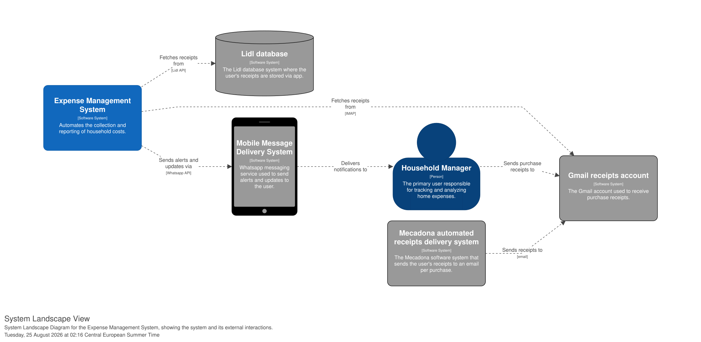
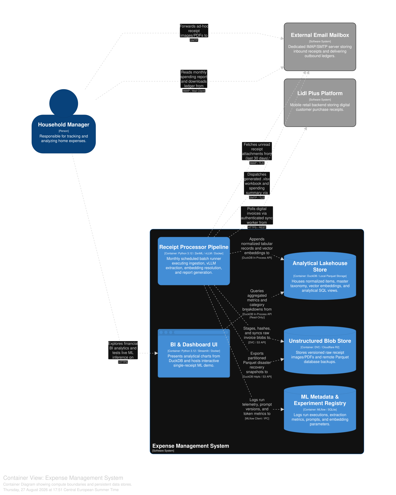
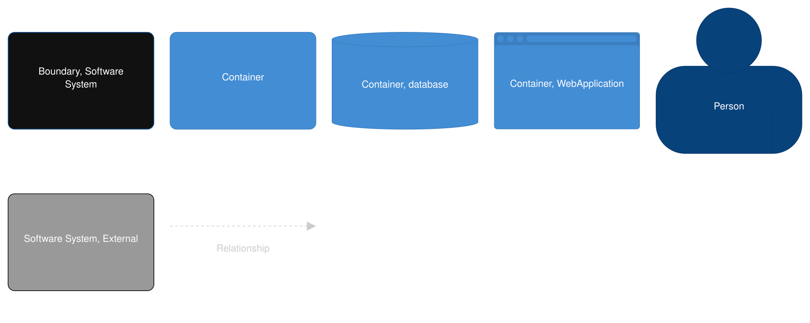

# Architecture & System Design

The system's architecture is mapped using the [C4 model](https://c4model.com/) to facilitate understanding across different technical levels. To ensure maintainability and version control, I adopted an Architecture as Code (AaC) approach using the [Structurizr DSL](https://structurizr.com/) to generate the System Context and Container diagrams.

## Level 1: System Context

[Insert high-level summary of the context diagram here. e.g., The system interacts with household members and external receipt-processing APIs.]

## Level 2: Container

[Insert high-level summary of the containers. e.g., The architecture is divided into a web application, a backend API gateway, and a relational database.]

